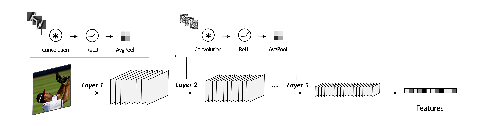

# High performing untrained models of primate visual cortex



The expansion model is a learning-free convolutional neural network based on compressession in the spatial domain and expansion in the feature domain. To use the model for your own data, please follow the steps incuded in section 1. To reproduce the results from our bioarxiv preprint, refer to section 2. 


# 1. Using Expansion model

- Please download (only) the folder ```/model_features/models```. This is easily done using https://download-directory.github.io/.
  

- Navigate to the repo folder and install requirements:
```
pip install -r requirements.txt 
```

Below is an example of how to use the expansion model. Alternatively, you can navigate to 'main.ipynb` for an example.

1. Import the model
```python
from expansion import Expansion5L
```

2. Import (preprocessed) images as a torch tensor. Below is a random image tensor of size NxCxHxW. Where N = number of images, C = number of channels, H = height of the image, W = width of the image.
   
```python
X = troch.Tensor(1,3,224,224)
```

3. Instantiate the model
```python
expansion_model = Expansion5L(filters_5 = 3000, # number of filters in the last convolution layer of the model
                              device='cuda').Build()

```

4. Extract image features
```python
features = expansion_model(X)
```

The ouput is a tensor of size NxP, where N = the number of image and P = the number of features in the last layer of the model.


# 2. Reproducing manuscript results

## 1. Initial setup

Clone this repository and navigate to the repository folder.
```
git clone https://github.com/akazemian/untrained_models_of_visual_cortex.git
```

Download the data used in all analysis [here](https://www.dropbox.com/scl/fo/ow0v17ldsax4iddtp82aj/AEwkme4Crdi0d80hv2zigC8?rlkey=sfzri315280ohr72mwyz9850j&st=4jxnohjt&dl=0). 


In the root directory, open ```config.py``` and set the path for the data folder ```DATA```. 

```
DATA = '/data' 
```

Install required packages:
```
pip install -r requirements.txt 
```

## 2. Generating results files

Navigate to the project directory and make sure to specify the dataset (```majajhong``` or ```naturalscenes```) when running the following.

To generate brain similarity score for the untrained models and alexnet: 
```
python encoding_score/main_results.py --dataset majajhong
```

To generate the PCA results:
```
python encoding_score/pca_analysis.py --dataset majajhong
```

To generate model ablation results:
```
python encoding_score/pca_analysis.py --dataset majajhong
```

To generate image classification results using the places dataset:
```
python image_classification/run.py 
```

## 3. Generating figures

Navigate to the ```figures``` folder. Here you will find notebooks for generating each figure individually. These are saved in ```figures/manuscript_figures```

## 4. Information about datasets:

When generating the results, the stimuli and preprocessed neural data are downloaded using the DATA path set earlier. This is done to increase efficiency. Alternatively, information about how to download and process the raw data manually is described below. The code used for preprocessing the neural data can be found in ```tools/neural_data_processing```

### The Majajhong dataset 

**Data**: The monkey electrophysiology dataset (Majaj et al., 2015) is available as part of the [Brain-score GitHub package](https://github.com/brain-score):. 

**Preprocessing**: We use the average response to stimuli across repetitions. 

### The Naturalscenes dataset:

Data: The Natural Scenes Dataset human fMRI dataset (Allen et al., 2022) can be downloaded [here](https://naturalscenesdataset.org/). 

Preprocessing: We use the NSD single-trial betas, preprocessed in 1.8-mm volume space and denoised using the GLMdenoise technique (version 3; “betas_fithrf_GLMdenoise_RR”) (Kay et al., 2013). We converted the betas to z-scores within each scanning session and computed the average betas for each NSD stimulus across repetitions. 


### The Places dataset:

Data: The Places dataset (Zhou et al, 2018) can be downloaded [here](http://places2.csail.mit.edu/)


### References

Allen, E. J., St-Yves, G., Wu, Y., Breedlove, J. L., Prince, J. S., Dowdle, L. T., Nau, M., Caron, B., Pestilli, F., Charest, I., Hutchinson, J. B., Naselaris, T., & Kay, K. (2022). A massive 7T fMRI dataset to bridge cognitive neuroscience and artificial intelligence. Nature Neuroscience, 25(1), 116–126. https://doi.org/10.1038/s41593-021-00962-x 

Majaj, N. J., Hong, H., Solomon, E. A., & DiCarlo, J. J. (2015). Simple Learned Weighted Sums of Inferior Temporal Neuronal Firing Rates Accurately Predict Human Core Object Recognition Performance. Journal of Neuroscience, 35(39), 13402–13418. https://doi.org/10.1523/JNEUROSCI.5181-14.2015 

Zhou, B., Lapedriza, A., Khosla, A., Oliva, A., & Torralba, A. (2018). Places: A 10 Million Image Database for Scene Recognition. IEEE Transactions on Pattern Analysis and Machine Intelligence, 40(6), 1452–1464. https://doi.org/10.1109/TPAMI.2017.2723009 


  
  
